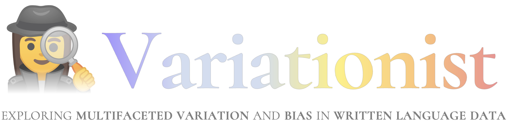

<p align="center"></img></p>

<div align="center">

[](LICENSE)
[](https://pypi.org/project/variationist/0.1.4/)
[](https://www.python.org/downloads/)
[](https://variationist.readthedocs.io/en/latest/)
[](https://github.com/dhfbk/variationist/tree/main/examples)

</div>

🕵️‍♀️ **Variationist** is a highly-modular, flexible, and customizable tool to analyze and explore language variation and bias in written language data. It allows researchers, from NLP practitioners to linguists and social scientists, to seamlessly investigate language use across many dimensions and a wide range of use cases.

- :cd: [**Installation**](#installation)
- :checkered_flag: [**Quickstart**](#quickstart)
- :closed_book: [**Tutorials**](#tutorials)
- :book: [**Documentation**](#documentation)
- :video_camera: [**Video**](#video)
- :airplane: [**Roadmap**](#roadmap)
- :cyclone: [**Contributors**](#contributors)
- :pencil2: [**Citation**](#citation)


## Installation

### Python package

🕵️‍♀️ Variationist can be installed as a python package from [PyPI](https://pypi.org/) using the `pip` command as follows:

```
pip install variationist
```

### Installing from source

Alternatively, 🕵️‍♀️ Variationist can be installed from source as follows:

1) Clone this repository on your own path:
```
git clone https://github.com/dhfbk/variationist.git
```

2) Create an environment with your own preferred package manager. We used [python 3.9](https://www.python.org/downloads/release/python-390/) and dependencies listed in [`requirements.txt`](requirements.txt). If you use [conda](https://docs.conda.io/en/latest/), you can just run the following commands from the root of the project:

```
conda create --name variationist python=3.9         # create the environment
conda activate variationist                         # activate the environment
pip install --user -r requirements.txt              # install the required packages
```


## Quickstart

🕵️‍♀️ Variationist works in a few line of codes and supports a wide variety of use cases in many dimensions. Below is an introductory example on how it can be used to explore variation and bias on a very simple dataset with a single text column and just a variable.

### 1) Import 🕵️‍♀️ Variationist

We first import the main classes useful for computation and visualization as follows:

```python
from variationist import Inspector, InspectorArgs, Visualizer, VisualizerArgs
```

A brief description for the classes is the following:
- **`Inspector`** (and **`InspectorArgs`**): it takes care of orchestrating the analysis, from importing and tokenizing the data to calculating the metrics and creating outputs with all the calculated metrics for each text column, variable, and combination thereof. It relies on `InspectorArgs`, a dataclass that allows the user to specify a variety of arguments that relate to the analysis.
- **`Visualizer`** (and **`VisualizerArgs`**): it takes care of orchestrating the creation of a variety of interactive charts showing up to five dimensions based on the results and metadata from a prior analysis using `Inspector`. It relies on `VisualizerArgs`, a class storing the specific arguments for visualization.

### 2) Define and run the *Inspector*

Now, we aim to **inspect the data**. For this example, we use a column `text` and just a single `label` variable (with a default *nominal* [variable type](https://github.com/dhfbk/variationist/tree/main/docs/variables.md) and a default *general* [variable semantics](https://github.com/dhfbk/variationist/tree/main/docs/variables.md)); however, note that 🕵️‍♀️ Variationist can seamlessly handle a potentially unlimited number of variables and up to two text columns during computation. We just use `npw_pmi` as our association [metric](https://github.com/dhfbk/variationist/tree/main/docs/metrics.md) and rely on single tokens as our [unit of information](https://github.com/dhfbk/variationist/tree/main/docs/units.md), using a default [tokenizer](https://github.com/dhfbk/variationist/blob/main/docs/tokenizers.md). We also ask for some [preprocessing](https://github.com/dhfbk/variationist/tree/main/docs/preprocessing.md) steps (stopwords removal in English and lowercasing). The output is stored in the `results` variable but it can alternatively be serialized to a .json file for later use.

```python
# Define the inspector arguments
ins_args = InspectorArgs(text_names=["text"], var_names=["label"], 
    metrics=["npw_pmi"], n_tokens=1, language="en", stopwords=True, lowercase=True)

# Run the inspector and get the results
res = Inspector(dataset="data.tsv", args=ins_args).inspect()
```

### 3) Define and run the *Visualizer*

Finally, we aim to **visualize the results**. The visualizer currently handles the creation of interactive [charts](https://github.com/dhfbk/variationist/tree/main/docs/charts.md) for more than 30 combinations of [variable type and semantics](https://github.com/dhfbk/variationist/tree/main/docs/variables.md) up to five dimensions, in which two of them are naturally fixed: the [units](https://github.com/dhfbk/variationist/tree/main/docs/units.md) (*nominal*) and their [metric](https://github.com/dhfbk/variationist/tree/main/docs/charts.md) scores (*quantitative*). For this example, we output in the output folder `my_charts` the results in a `html` format (i.e., the default and suggested one for the sake of interactivity).

```python
# Define the visualizer arguments
vis_args = VisualizerArgs(output_folder="charts", output_formats=["html"])

# Create interactive charts for all metrics
charts = Visualizer(input_json=res, args=vis_args).create()
```

Optionally, interactive charts can be visualized in notebooks by just taking the object returned from the `create()` function. For instance, if the object is stored in a variable named `charts`, visualization would be as simple as writing the following string in the notebook: `charts[$METRIC][$CHART_TYPE]`, where `$METRIC` is the metric of interest and `$CHART_TYPE` is a specific chart type associated with that metric.


## Tutorials

You can find our tutorials to learn how to better leverage 🕵️‍♀️ **Variationist** in the [`examples/`](https://github.com/dhfbk/variationist/tree/main/examples) folder.

There you can also find a set of interesting case studies using real-world datasets! :chart_with_upwards_trend:


## Documentation

You can find more information on specific topics in the following documents:
- [Input dataset](https://github.com/dhfbk/variationist/tree/main/docs/input-dataset.md): from `.tsv` or `.csv` files to pandas dataframes and [Hugging Face](https://huggingface.co/) datasets
- [Units](https://github.com/dhfbk/variationist/tree/main/docs/units.md): from tokens and *n*-grams to co-occurrences with windows and duplicate handling
- [Tokenizers](https://github.com/dhfbk/variationist/tree/main/docs/tokenizers.md): from a whitespace tokenizer to [Hugging Face](https://huggingface.co/) tokenizers and custom ones
- [Variables](https://github.com/dhfbk/variationist/tree/main/docs/variables.md): possible variable types and variable semantics, and their interdependence
- [Metrics](https://github.com/dhfbk/variationist/tree/main/docs/metrics.md): from basic statistics to lexical diversity, association metrics, and custom ones
- [Charts](https://github.com/dhfbk/variationist/tree/main/docs/charts.md): from scatter charts to choroplets, from heatmaps to temporal line plots and others
- [Custom components](https://github.com/dhfbk/variationist/tree/main/docs/custom-components.md): how to define your own components

A technical documentation for 🕵️‍♀️ **Variationist** is also available at: [https://variationist.readthedocs.io/en/latest/](https://variationist.readthedocs.io/en/latest/).


## Video

An short introductory video is available [here](https://drive.google.com/file/d/1wBQVjiuDnGn9V7OWy-T8J7I4OlbV1gAZ/view?usp=sharing).


## Roadmap

🕵️‍♀️ **Variationist** aims to be as accessible as possible to researchers from a wide range of fields. We thus aim to provide the following features in the next releases:
- An easy to use graphical user interface to be installed locally or used through [Hugging Face Spaces](https://huggingface.co/spaces);
- Extension of the `unit` concept to also cover linguistic aspects beyond the lexical level.


## Contributors

- **[Alan Ramponi](https://alanramponi.github.io)**, *Fondazione Bruno Kessler*
- **[Camilla Casula](https://dh.fbk.eu/author/camilla/)**, *Fondazione Bruno Kessler* and *University of Trento*
- **[Stefano Menini](https://dh.fbk.eu/author/stefano/)**, *Fondazione Bruno Kessler*


## Citation

A preprint will be available soon! :construction: In the meanwhile, if you use 🕵️‍♀️ **Variationist** in your work please cite:

```
@misc{ramponi-etal-2024-variationist,
  author = {Ramponi, Alan and Casula, Camilla and Menini, Stefano},
  title = {Variationist: {E}xploring Multifaceted Variation and Bias in Written Language Data},
  year = {2024},
  publisher = {GitHub repository},
  howpublished = {\url{https://github.com/dhfbk/variationist}}
}
```
